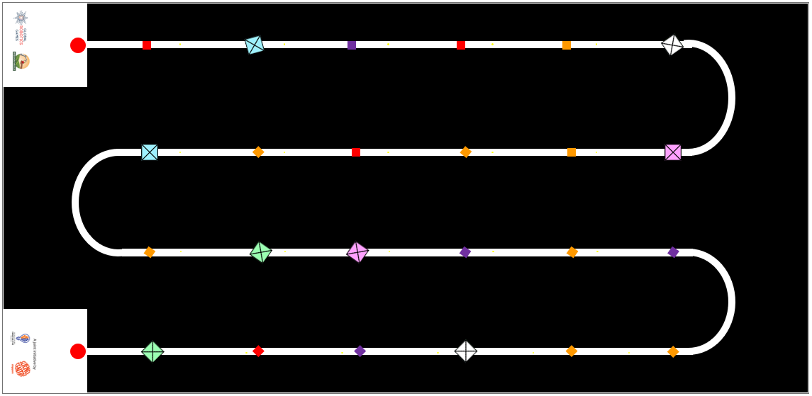

# AIMS: AI 創客系列 (AI Maker Series) 完整中文規則

> [!IMPORTANT]
> 此中文規則完全基於官方最新釋出的 PDF 進行精準翻譯與校對。排版已同步原網站設計。

## 1. 簡介 (INTRODUCTION)
### AI 創客系列 2026：精準收成 (AI Maker Series 2026: Precision Harvest)

**挑戰：收成後損失 (THE CHALLENGE: POST-HARVEST LOSS)**
當我們為實現「零飢餓 (SDG 2)」的世界而努力時，我們面臨著一個嚴重的低效問題：在全球範圍內，大約有 14% 的食物在收成與市場之間損失。這種「收成後損失」是我們糧食系統中一個價值數兆美元的漏洞，通常是由我們用來收集食物的工具所造成的。

**神經網路解決方案：「溫柔的巨人」 (THE NEURAL SOLUTION: THE "GENTLE GIANT")**
為了解決這個問題，我們需要結合工業效率與生物敏感性的技術。您的任務是設計一個能夠在複雜的「蛇形路徑 (Serpentine Path)」溫室地形中導航的自主機器人。
利用機器學習 (Machine Learning)，您的機器人必須作為一個選擇性收割機：識別並只收集成熟的農作物，同時嚴格保持脆弱的未成熟植物不受干擾。

**任務目標 (MISSION OBJECTIVES)**

> **⚠ 經濟陷阱 (The Economic Trap)**
> 農民依賴「盲目」的大型機械，這些機械會摧毀高達 40% 的未成熟農作物（花朵和綠芽），從而永久降低未來的產量。

> **🧪 化學反應 (Ethylene Reaction)**
> 粗暴的處理會使農產品碰傷，引發乙烯氣體的釋放。這種反應會導致快速腐敗，在 48 小時內浪費掉健康的食物。

- 🤖 **自主導航 (Autonomous Navigation)**：掌握複雜的溫室蛇形路徑。
- 🧠 **電腦視覺 (Computer Vision)**：使用機器學習區分成熟與未成熟的農產品。
- 🦾 **精準操作 (Precision Handling)**：收割農作物而不損害未來的產量或環境。

**系統參考文獻 (System References):**
- FAO: The State of Food and Agriculture (2019)
- MDPI: Horticultural Robotics and AI Analysis
- JIRCAS: Post-Harvest Research Publication
- UN Stats: SDG Indicator Metadata

*TRAINING MODELS. INCREASING INTELLIGENCE. EXECUTE MISSION.*

---

## 2. 比賽場地 (Game Field)

### 2.1 視覺概述 (VISUAL OVERVIEW)
比賽在一個測量為 **2362 mm x 1143 mm (+-5mm 誤差)** 的高精度工作區上進行。(截至 21-5-26 更新)
場地由一個深色地墊組成，上面有一條連續的、高對比度的白色軌道。其佈局模仿了「蛇形 (Serpentine)」或「蛇」的圖案，旨在模擬機器人在農業行列中來回導航。

### 2.2 基地站 (起點與終點) (BASE STATIONS (START & END))
在場地的最左側有兩個白色的方形盒子 (250mm x 250mm)：
- **頂部基地 (Top Base)**：連接到第一條軌道行的起點。
- **底部基地 (Bottom Base)**：連接到最後一條軌道行的終點。

**功能 (Function)**：在每次運行前，裁判會指定一個盒子作為**起點 (START)**，並將對面的盒子指定為**終點 (END)**。每次機器人運行時，起點和終點的盒子都可能會**隨機互換**。

### 2.3 軌道佈局 (TRACK LAYOUT)
軌道將兩個基地站連接起來，形成一條蜿蜒的路徑，包含：
- **4 個直線路段 (Straight Sections)**：放置「農作物」(遊戲物件) 的長平行線。每個路段有 5 個黃點，指示方塊的隨機位置。
- **3 個彎道 (Bends)**：平滑的 180 度半圓形轉彎，在場地上創造出連續的之字形 (zig-zag) 運動。

**庫存：農業方塊 (INVENTORY: AGRICULTURAL CUBES)**
| 大方塊 (Large Cubes) | 小方塊 (Small Cubes) |
| --- | --- |
| 藍色 x 2 | 紫色 x 4 |
| 白色 x 2 | 紅色 x 4 |
| 粉色 x 2 | 橘色 x 8 |
| 綠色 x 2 | --- |

*FIELD CONFIGURED. SENSORS CALIBRATED. EXECUTE NAVIGATION.*

---

## 3. 遊戲物件 (Game Objects)

### 3.1 物件規格 (OBJECT SPECIFICATIONS)
挑戰賽使用兩種類型的磁性方塊來代表不同的農作物狀態。

- **大方塊 (未成熟水果) (LARGE CUBE (Unripe Fruit))**
  - 50mm x 50mm x 50mm
- **小方塊 (成熟水果) (SMALL CUBE (Ripe Fruit))**
  - 25mm x 25mm x 25mm

### 3.2 放置區域 (PLACEMENT ZONES)
直接標記在白色軌道上的特定黃點，指示了所有遊戲物件的指定生成位置。

*圖示為為了清楚設定而放大的黃點位置：*

### 3.3 設置程序 (SETUP PROCEDURE)
裁判將根據以下協議執行設置：
- 🔍 **覆蓋規則 (The Covering Rule)**：只有當方塊的底部完全覆蓋 (隱藏) 其下方的黃點時，才算正確放置。
- 📏 **驗證 (Verification)**：不需要與軌道邊緣精確對齊。只要生成點被方塊隱藏即可。
- 🔄 **方向 (Orientation)**：方塊的旋轉是隨機的。物件可以平行於軌道或以任何角度放置。

*HARDWARE SPECIFICATIONS VALIDATED. INITIALIZE ENVIRONMENT SETUP.*

---

## 4. 遊戲目標 (Game Objectives)

### 4.1 任務目標 (THE MISSION GOAL)
設計並建造一個自主機器人，作為一個「溫柔的巨人」，能夠使用人工智慧在軌道上導航以區分成熟與未成熟的農作物，並選擇性地收割產量而不損壞田地。

### 4.2 運行目標 (THE RUN OBJECTIVES)
在單次任務執行期間，代理 (agent) 必須達成以下邏輯里程碑：
- 🚀 **部署 (DEPLOY)**：從指定的起點盒子啟動。
- 🛰 **導航 (NAVIGATE)**：沿著所有直線與彎道的蛇形路徑行駛。
- 🔍 **識別 (IDENTIFY)**：使用 AI/ML 模型檢測黃色座標上的物件。
- 📥 **運送 (DELIVER)**：將「成熟水果」(小方塊) 運送到終點盒子。

**⚡ AI 辨識矩陣 (AI DISCRIMINATION MATRIX)**
- **小方塊 (25mm)** -> 分類為「成熟水果」 -> 動作：**收集 (COLLECT)**
- **大方塊 (50mm)** -> 分類為「未成熟水果」 -> 動作：**避開 (AVOID)**

### 4.3 完成完整運行 (COMPLETING A FULL RUN)
- **成功標準 (Success Criteria)**：只有當機器人導航了整條路徑，並在終點盒子內執行了完全自主的停止，才算正式完成一次運行。
- **路徑驗證 (尋線) (Path Validation (Line Following))**：
  - **投影 (Projection)**：底盤必須始終與白線垂直重疊。
  - **⚠ 偏離路徑 (Loss of Path)**：完全偏離路線且未進行修正，將導致裁判停止比賽。
  *(只要機器人的任何部分投影在線上，就被視為沿著路徑行駛。)*

**任務計分演算法 (MISSION SCORING ALGORITHM)**
| 要求 (Requirement) | 條件 (Condition) | 分數 (Points) |
| --- | --- | --- |
| **自主停車 (Autonomous Park)** | 在終點盒子內停止 (Stop within End Box) | +50 |
| **成功收成 (Successful Yield)** | 每個送達的小方塊 (Per Small Cube Delivered) | +10 |
| **精度失敗 (Precision Failure)** | 每個在終點盒子內的大方塊 (Per Large Cube in End Box) | -20 |

*NAVIGATION VERIFIED. ALGORITHM READY. EXECUTE START SEQUENCE.*

---

## 5. 比賽規則 (Game Rules)
如果在機器人嘗試期間有任何不確定性，裁判將做出最終決定。如果在無法做出明確決定的情況下，裁判應做出有利於隊伍的決定。

### 5.1 賽前準備 (PRE-RUN)
- 隊伍將其機器人完全放入起點區塊內。
- 裁判將測量機器人的寬度和長度。機器人尺寸必須在 **250 mm x 250 mm** 以內。機器人高度不限。
- 在每次比賽運行之前，裁判會將大方塊和小方塊隨機安排在黃點上。方塊的配置只有在隊伍將機器人隔離後才會展示給隊伍。

下圖為大方塊與小方塊隨機放置在場地上的範例：

### 5.2 機器人運行開始 (START OF ROBOT RUN)
- 裁判發出開始信號時計時開始。
- 隊伍可以運行他們的程式碼並讓機器人移動。
- **時間限制 (Time limit)**：每支隊伍的時間限制為 **4 分鐘**。機器人必須在規定的時間限制內到達終點盒子並停止。

### 5.3 機器人運行期間 (DURING ROBOT RUN)
隊伍必須確保其機器人具備在軌道內指定路徑導航的能力，並專門透過隊伍開發的人工智慧 (AI) 或機器學習 (ML) 模型來識別大方塊與小方塊。
感測器只能用於支援機器人的移動，不能用於檢測卡片/方塊。
任何被懷疑使用非 AI/ML 模型來檢測方塊的隊伍，可能會被叫停，並要求向裁判展示其機器人程式碼、系統和 AI/ML 模型。**未能證明 AI/ML 模型是唯一用於方塊檢測的系統可能會導致取消資格。**

**隊伍允許 (Teams are allowed)：**
- 中斷他們的機器人，停止機器人並保持原狀。
- 只有裁判才能給予隊伍拿起機器人的信號。
- 該次嘗試完成一回合將被視為「不完整」。所有先前檢測到的方塊將根據成功識別進行計分。
- 隨時停止他們的機器人。
- 隊伍在選擇停止機器人時必須通知裁判。機器人將必須留在比賽場地上的該位置。

**隊伍不允許 (Teams are not allowed)：**
- 在運行之前、期間和之後觸碰任何方塊。

### 5.4 機器人運行結束 (ENDING OF ROBOT RUN)
機器人運行將在以下情況結束：
- 機器人完全離開比賽桌面。
- 機器人或隊伍違反規則或規定。
- 隊員大喊「STOP」，且機器人不再移動。如果機器人仍在移動，該次嘗試只有在機器人自行停止或被隊伍或裁判停止後才會結束。

在每次比賽運行之後，裁判將評估運行並相應地分配分數。隊伍必須驗證並認可記錄在計分表（紙本或數位格式）上的分數。一旦分數被隊伍確認並簽名，就不允許進一步的更改。
如果隊伍在一段時間後（隊伍可以在比賽當天與裁判澄清）不想簽名，裁判可以決定取消該隊伍在該次比賽運行的資格。隊伍的教練不允許加入與裁判關於比賽運行計分的討論。影片或照片證明將不被接受。
隊伍的排名取決於整體的錦標賽形式。例如，將使用比賽運行中最好的一次嘗試，如果參賽隊伍總分相同，排名將由記錄的時間決定。

---

## 6. 機器人材料與規定 (Robot Materials and Regulations)

### 硬體與智慧限制 (HARDWARE & INTELLIGENCE CONSTRAINTS)
AI 創客系列代理 (agents) 的技術架構要求。

**底盤與控制器架構 (CHASSIS & CONTROLLER ARCHITECTURE)**
每支隊伍建造一個機器人來解決場地上的挑戰。機器人在開始運行前的最大尺寸為 25cm x 25cm。電纜必須包含在這些尺寸內。
機器人可以使用任何建築材料建造。例如：LEGO 積木、預先切割的塑膠車身、配備攝影機的機器人。
機器人可以配備任何控制器系統。例如：Arduino 板、Raspberry Pi、Quarky、LEGO Education SPIKE Prime hub，且：可以使用超過一個控制器。

**⚠ 禁止的預建邏輯 (PROHIBITED PRE-BUILT LOGIC)**
機器人不應是製造商預先設計和預先編碼使用 AI 來循線或循跡的車輛或機器人。
(例如：JetRacer AI, AWS DeepRacer vehicle)
對於小學組，只允許最低限度在基於積木的編碼平台上運行的機器人。此外，這些機器人系統不得由製造商專門為檢測大方塊或小方塊的明確目的而預先設計。

**🧠 AI 模型開發 (AI MODEL DEVELOPMENT)**
對於 AI 模型：
- 隊伍必須建立自己的類別 (Classes) 來訓練他們的 ML 模型以視覺識別每個物件。
- 任何自動建立類別以檢測各種物件進行視覺辨識的設備/系統，將不被允許。

- 🔋 **電源 (POWER)**：機器人必須由其攜帶的電池系統供電。機器人必須是自給供電的。
- ⚙ **馬達 (MOTORS)**：使用的馬達數量不受限制。
- 📷 **視覺 (VISION)**：機器人最多只能安裝 1 個攝影機。

隊伍應將機器人的控制器/主機放置在方便裁判檢查程式與停止機器人的位置。
除了在裁判的信號下，隊伍不允許在機器人開始比賽運行後執行任何動作或移動來干擾或協助機器人。

**無線與數據管理 (WIRELESS & DATA MANAGEMENT)**
允許使用任何軟體來編寫機器人程式，隊伍可以在比賽日之前準備程式碼。如果隊伍使用需要網路連線的軟體（例如基於瀏覽器的工具），隊伍應檢查是否有適合比賽日的離線版本。比賽主辦方不負責提供網路基礎設施（例如提供給所有人的 Wi-Fi）。
在檢查時間和比賽運行期間，必須關閉藍牙、Wi-Fi 或任何遠端連線。隊伍只有在沒有其他方法可以將程式碼從裝置（例如平板電腦）傳輸到控制器時，才能使用遠端連線。然而，強烈建議使用傳輸線來傳輸程式碼，以避免比賽當天出現問題（例如多個裝置使用相同名稱）。當然，不允許使用遠端連線來干擾或阻礙任何其他隊伍或機器人。
隊伍應準備並攜帶在錦標賽期間所需的所有設備、足夠的備用零件、軟體和筆記型電腦。隊伍在比賽當天不允許共用筆記型電腦和/或機器人的程式。比賽主辦方不負責任何材料的維護或更換，即使在發生任何事故或故障的情況下也是如此。
機器人可以被標記（標籤、緞帶等），以防止參賽者遺失或與其他隊伍的機器人混淆，只要這不會改變其性能或提供有關組裝過程的線索。
隊伍可以將組裝好的機器人帶到比賽現場。他們不需要在比賽當天重新組裝機器人。

*SYSTEM CONSTRAINTS VERIFIED. LOCAL STORAGE VALIDATED. FINAL CHECK COMPLETE.*

---

## 6.3 技術報告 (TECHNICAL REPORT)
在建立機器人與 AI 或 ML 模型時，我們也必須注意記錄我們的工作。優秀的工程師是能夠在報告中一絲不苟，並能有效溝通其工作的人。
所有隊伍都必須在（日期將於稍後公佈）前提交其技術報告的數位副本。以下是應報告的詳細資訊。

### 6.3.1 機器人設計 (Robot Design):
每支隊伍需要提交其機器人每一側的 1 張圖片。也就是：
- 機器人頂部的圖片。
- 機器人底部 (bottom top) 的圖片。
- 機器人左側的圖片。
- 機器人右側的圖片。
- 機器人正面的圖片。
- 機器人背面的圖片。

### 6.3.2 感測器與攝影機清單 (List of Sensors and Cameras):
隊伍應清楚識別並列出機器人中使用的所有感測器與攝影機。學生還應註明如何使用感測器/攝影機，並展示程式碼範例來說明如何使用這些感測器/攝影機的輸入。

### 6.3.3 人工智慧模型 (Artificial Intelligence model):
隊伍還應描述建立的 AI 或 ML 模型，該模型允許機器人檢測左轉和右轉方塊（這是他們採用的策略）。隊伍應描述以下內容：
- 訓練 AI 模型以達成這些任務的過程。
- 用於建立 AI 模型的軟體。
- 建立 AI 模型所使用的程式語言。
- 機器人是如何被編程以對 AI 模型做出反應的？

將提供報告範例與報告骨架 (skeleton report)。學生應研究該範例並了解所期望的報告水準。然後，隊伍必須利用報告骨架並建立他們的報告。將與每支隊伍分享一個線上雲端硬碟/資料夾，讓他們可以分享他們的技術報告。

*DOCUMENTATION SYNCHRONIZED. SYSTEM INTEGRITY VERIFIED. EXECUTE REPORT SUBMISSION.*

---

## 7. 計分 (Scoring)

**計分定義 (SCORING DEFINITIONS)**
「完全 (Completely)」意味著機器人及其所有部分都越過了考量區域/線。機器人的任何投影都不會落在考量區域/線內。

**任務計分矩陣 (MISSION SCORING MATRIX)**
| 任務 (TASKS) | 分數 (POINTS) | 總計 (TOTAL) |
| --- | --- | --- |
| 🚀 **運行完成：從起點到終點 (RUN COMPLETION: Start to End)** 機器人完全從指定的起點區塊啟動，並完全在指定的終點區塊結束。 *移動必須自動停止；無手動干擾。* | **50** | |
| 📦 **方塊收集邏輯 (CUBE COLLECTION LOGIC)** | | |
| 機器人擁有的每個小方塊 (成熟水果) | **+10** | |
| 機器人擁有的每個大方塊 (未成熟水果) | **-20** | |

**技術報告評分標準 (TECHNICAL REPORT GRADING RUBRICS)**
對 AI 模型開發進行一絲不苟的記錄與有效的溝通。

| 主題 (Topic) | 起步 (Beginning) (1-5 分) | 發展中 (Developing) (6-14 分) | 熟練 (Accomplished) (15-20 分) | 總分 (Total) |
| --- | --- | --- | --- | --- |
| **機器人設計 (Robot Design)** | 缺少圖片；缺少標籤；最少的組件描述。 | 提供圖片；部分標籤；描述了一些關鍵組件。 | 標籤清晰的圖片；全面的組件描述。 | |
| **感測器與攝影機 (Sensors & Cameras)** | 清單不完整；缺乏技術規格與程式碼範例。 | 清單完整；基本的技術規格與程式碼範例。 | 清單詳細；透徹的技術規格與附有註解的程式碼。 | |
| **AI 模型建立 (AI Model Creation)** | AI 模型描述模糊；缺乏訓練過程細節。 | 一般的 AI 模型描述；基本的訓練過程。無圖解說明。 | 詳細的 AI 模型描述；透徹的訓練解釋與困難描述。 | |

*E N D*
*MISSION DATA LOGGED // SYSTEM STANDBY*
