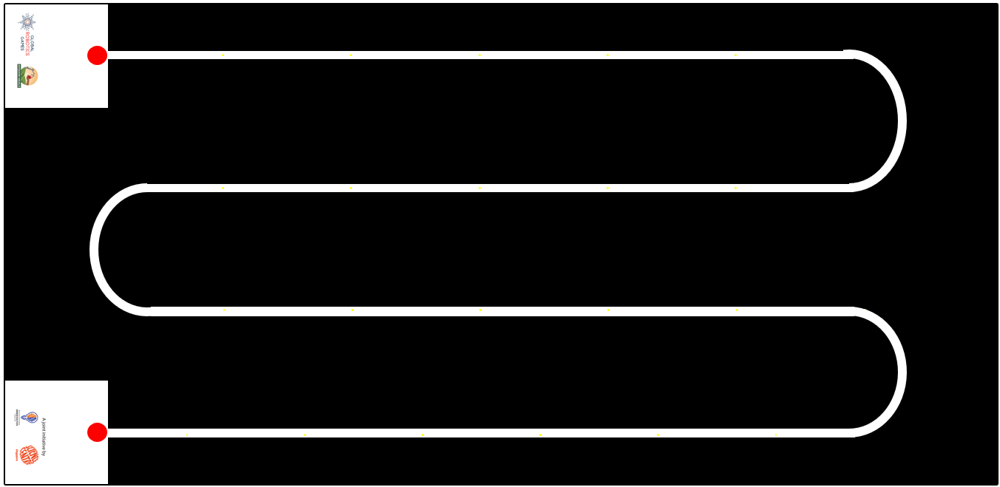
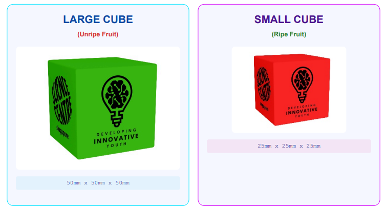
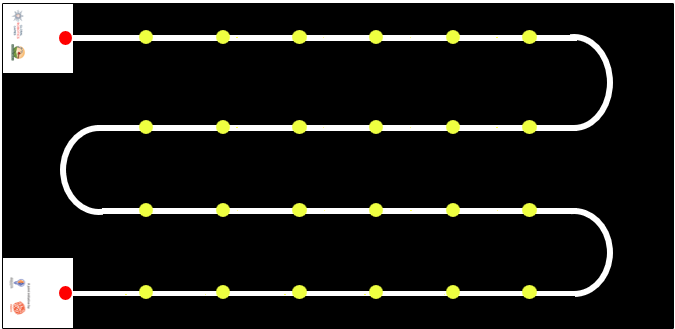

# 2026 GRG AI Maker Series (AIMS) Rules - Original English Version

> [!IMPORTANT]  
> This is the exact verbatim original English rulebook as provided by the official Global Robotics Games.

## 1. INTRODUCTION

**AI Maker Series 2026: Precision Harvest**

**THE CHALLENGE: POST-HARVEST LOSS**  
As we strive for a world with Zero Hunger (SDG 2), we face a critical inefficiency: globally, approximately 14% of food is lost between the harvest and the market. This "Post-Harvest Loss" is a trillion-dollar leak in our food system, often caused by the very tools we use to gather our food.

**THE NEURAL SOLUTION: THE "GENTLE GIANT"**  
To solve this, we need technology that combines industrial efficiency with biological sensitivity. Your mission is to engineer an autonomous robot capable of navigating a complex "Serpentine Path" greenhouse terrain.  
Using Machine Learning, your robot must act as a selective harvester: identifying and collecting only ripe crops while leaving fragile unripe plants strictly undisturbed.

### MISSION OBJECTIVES

**⚠ The Economic Trap**  
Farmers rely on "blind" mass machinery that destroys up to 40% of unripe crops—flowers and green buds—permanently reducing future yield.

**ANALYSIS**  
**🧪 Ethylene Reaction**  
Rough handling bruises produce, triggering Ethylene gas release. This reaction causes rapid spoilage, wasting healthy food within 48 hours.

**CHEMICAL**  
- 🤖 **Autonomous Navigation:** Master the complex greenhouse Serpentine Path.
- 🧠 **Computer Vision:** Use ML to differentiate between ripe and unripe produce.
- ⚙️ **Precision Handling:** Harvest crops without damaging future yields or the environment.

*System References:*  
- FAO: The State of Food and Agriculture (2019)  
- MDPI: Horticultural Robotics and AI Analysis  
- JIRCAS: Post-Harvest Research Publication  
- UN Stats: SDG Indicator Metadata  

*TRAINING MODELS. INCREASING INTELLIGENCE. EXECUTE MISSION.*

---

## 2. Game Field

### 2.1 VISUAL OVERVIEW
The competition takes place on a high-precision workspace measuring 2362 mm by 1143 mm (+-5mm of error). (Updated as of 21-5-26)  
The playfield consists of a dark mat featuring a single, continuous, high-contrast white track. The layout mimics a "Serpentine" or "Snake" pattern, designed to simulate a robot navigating back and forth across agricultural rows.

### 2.2 BASE STATIONS (START & END)
Located on the far-left side of the field are two white square boxes (250mm by 250mm):
- **Top Base:** Connected to the beginning of the first track row.
- **Bottom Base:** Connected to the end of the last track row.

**Function:** Before each run, the Referee will designate one box as the START point and the opposite box as the END point. The Start and End boxes may be randomized for each robot run.

### 2.3 TRACK LAYOUT
The track connects the two Base Stations through a winding path consisting of:
- **4 Straight Sections:** Long, parallel lines where the "Crops" (Game Objects) are placed. Each section features 5 yellow dots indicating randomized positions for the cubes.
- **3 Bends:** Smooth, 180-degree semi-circular turns creating a continuous zig-zag motion across the field.

**INVENTORY: AGRICULTURAL CUBES**
| Large Cubes | Small Cubes |
| --- | --- |
| Blue x 2 | Purple x 4 |
| White x 2 | Red x 4 |
| Pink x 2 | Orange x 8 |
| Green x 2 | --- |

*FIELD CONFIGURED. SENSORS CALIBRATED. EXECUTE NAVIGATION.*

---

## 3. Game Objects

### 3.1 OBJECT SPECIFICATIONS
The challenge utilizes two types of magnetic cubes representing different crop states.

- **LARGE CUBE (Unripe Fruit)**  
  50mm x 50mm x 50mm
- **SMALL CUBE (Ripe Fruit)**  
  25mm x 25mm x 25mm

### 3.2 PLACEMENT ZONES
Specific Yellow Dots marked directly on the white track indicate designated spawning locations for all game objects.

*Graphic illustrates exaggerated yellow dot positions for setup clarity.*

### 3.3 SETUP PROCEDURE
Referees will execute the setup according to the following protocol:
- 🔍 **The Covering Rule:** A cube is correctly placed only if its base completely covers (hides) the Yellow Dot beneath it.
- 📏 **Verification:** Precise alignment with track edges is not required. As long as the spawning dot is hidden by the cube.
- 🔄 **Orientation:** Cube rotation is randomized. Objects may be parallel with the track or placed at any angle.

*HARDWARE SPECIFICATIONS VALIDATED. INITIALIZE ENVIRONMENT SETUP.*

---

## 4. Game Objectives

### 4.1 THE MISSION GOAL
To design and build an autonomous robot that acts as a "Gentle Giant", capable of navigating the track using Artificial Intelligence to distinguish between Ripe and Unripe crops, and selectively harvesting the yield without damaging the field.

### 4.2 THE RUN OBJECTIVES
During a single mission execution, the agent must achieve the following logic milestones:
- 🚀 **DEPLOY:** Initiate from the designated Start Box.
- 🛰️ **NAVIGATE:** Follow the serpentine path across all rows and bends.
- 🔍 **IDENTIFY:** Use AI/ML models to detect objects on yellow coordinates.
- 📥 **DELIVER:** Transport "Ripe Fruit" (Small Cubes) to the End Box.

**⚡ AI DISCRIMINATION MATRIX**
- **Small Cubes (25mm)** -> Classify: "Ripe Fruit" -> Action: **COLLECT**
- **Large Cubes (50mm)** -> Classify: "Unripe Fruit" -> Action: **AVOID**

### 4.3 COMPLETING A FULL RUN
- **Success Criteria:** A run is officially accomplished only when the robot navigates the entire path and executes a complete, autonomous stop within the End Box.
- **Path Validation (Line Following):**
  - **Projection:** Chassis must vertically overlap with the white line at all times.
  - **⚠ Loss of Path:** Straying completely off-line without correction results in a referee stop.  
  *(As long as the projection of any part of the robot is over the line, the robot is considered to be following the path.)*

**MISSION SCORING ALGORITHM**
| Requirement | Condition | Points |
| --- | --- | --- |
| **Autonomous Park** | Stop within End Box | +50 |
| **Successful Yield** | Per Small Cube Delivered | +10 |
| **Precision Failure** | Per Large Cube in End Box | -20 |

*NAVIGATION VERIFIED. ALGORITHM READY. EXECUTE START SEQUENCE.*

---

## 5. Game Rules

If there is any uncertainty during the robot attempt, the judge will make the final decision. The judge will decide in favour of the team if no clear decision is possible.

### 5.1 PRE-RUN
- Teams will place their robot completely within the Start block.
- Referees will measure the width and length of the robot.
- Robot must be within **250 mm x 250 mm** in size only. Robot may be of any height.
- Prior to each game-run, Referees will arrange the large cubes and the small cubes randomly on the yellow dots. The placement of the cubes will only be shown to the teams after they have quarantined their robots.
- The image below is an example of how the large cubes and small cubes may be placed on the playfield.

### 5.2 START OF ROBOT RUN
- Time begins when the referee gives the signal to start.
- Teams may run their programs/codes and let the robot move.
- Time limit: For each team, the time limit is **4mins**.
- The robot must reach the End box and stop within the stipulated time limit.

### 5.3 DURING ROBOT RUN
- Teams must ensure that their robot is equipped to navigate the designated path within the track and identify large cubes and small cubes exclusively through an Artificial Intelligence (AI) or Machine Learning (ML) model developed by the team.
- Sensors may only be employed to support the robot's movement and not for card detection purposes.
- Any team suspected of using any other means, except for an AI or ML model to detect the cubes, may be stopped and asked to show their robot’s codes, systems and AI or ML model to the Referees.
- Failure to prove that an AI or ML model is the sole system utilized for cube detection may lead to disqualification.

**Teams are allowed:**
- To interrupt their robot, stop the robot and leave it as it was.
  - Only Referees can give the signal to the team to pick up their robots.
  - That attempt to complete a round will be considered incomplete.
  - All previously detected cubes will be scored based on successful identification.
- To stop their robot at any time.
  - Teams must inform the Referee when choosing to stop their robot.
  - Robots will have to remain at that position on the playfield.

**Teams are not allowed:**
- To touch any of the cubes before, during and after the run.

### 5.4 ENDING OF ROBOT RUN
A robot run will end if...
- The robot has completely left the game table.
- The robot or team has violated the rules or regulations.
- A team member shouts “STOP”, and the robot does not move anymore. If the robot is still moving, the robot attempt will only end once the robot stops by itself or is stopped by the team or referee.

Following each game-run, Referees will evaluate the run and assign scores accordingly. Teams must verify and endorse the scores recorded on the scoring sheet, whether in paper or digital format. Once the score is confirmed and signed off by the team, no further alterations are permitted.
If a team does not want to sign off after a certain period of time (teams may clarify with referees on the day of the competition), the referee can decide to disqualify the team for this game-run. Coaches of the teams are not allowed to join the discussion with Referees on the scoring of the game-run. Video or photo proofs will not be accepted.
The ranking of teams depends on the overall tournament format. For example, the best attempt out of the game-runs will be used and if competing teams have the same points, the ranking is decided by the record of time.

---

## 6. Robot Materials and Regulations

**HARDWARE & INTELLIGENCE CONSTRAINTS**  
Technical architecture requirements for AI Maker Series agents.

### CHASSIS & CONTROLLER ARCHITECTURE
- Every team builds one robot to solve the challenges on the field. The maximum robot dimensions before the robots starts a run are 25cm x 25cm. Cables must be included in these dimensions.
- The robot may be built with any building materials. E.g. LEGO bricks, pre-cut plastic car bodies, robot fitted with camera.
- The robot may be fitted with any controller system. E.g. Arduino boards, Raspberry Pi, Quarky, LEGO Education SPIKE Prime hub, and:
  - More than one controller may be used.

### ⚠ PROHIBITED PRE-BUILT LOGIC
- The robot should not be a car or robot that is predesigned and pre-coded (by the manufacturer) to follow a line or route using AI. E.g. JetRacer AI, AWS DeepRacer vehicle.
- For Primary school category, only robots that minimally run on block-based coding platforms will be allowed. Furthermore, these robot systems must not be predesigned by the manufacture for the express purpose of detecting a large or small cubes.

### 🧠 AI MODEL DEVELOPMENT
For the AI model:
- Teams will have to create their own Classes to train their ML model to visually recognise each object.
- Any device/system that automatically creates Classes, to detect various objects for visual recognition, will not be allowed.

### POWER, MOTORS & VISION
- 🔋 **POWER:** The robot must be powered by a battery system carried by the robot. The robot must be self-powered.
- ⚙️ **MOTORS:** The number of motors to be used is not restricted.
- 📸 **VISION:** The robot may be fitted with only 1 camera.

A team should place the controller/hub of the robot in a way that makes it easy to check the program and stop the robot by a Referee.  
A team is not allowed to perform any actions or movements to interfere or assist the robot after the robot has started with the game-run, except with the Referees signal.

### WIRELESS & DATA MANAGEMENT
- Any software to code the robot is allowed and teams can prepare the code before the competition day. If a team uses a software that requires an online connection (e.g. a browser-based tool), the team should check if there is an offline version for the competition day. The competition organizer is not responsible to provide an online infrastructure (e.g. Wi-Fi for everyone).
- Bluetooth, Wi-Fi or any remote connection must be switched off during check time and game-runs. Teams can only use remote connections if there is no other way to transfer the code from a device (e.g. a tablet) to the controller. However, it is strongly recommended to transfer code via cable to avoid problems (e.g. multiple devices with the same name) at the competition day. Of course, it is not allowed to interfere or obstruct any other team or robot with the remote connections a team uses.
- A team should prepare and bring all the equipment, enough spare parts, software and portable computers it needs during the tournament. Teams are not allowed to share a laptop and / or the program for a robot on the competition day. The competition organizer is not responsible for the maintenance or replacement of any material, not even in case of any accidents or malfunctions.
- The robot can be marked (label, ribbons, etc.) to prevent participants from losing it or confusing it with the robots of the other teams, as long as this does not change its performance or give clues about the assembly process.
- Teams can bring the robots assembled to the competition. They do not need to rebuild the robots on the competition day.

*SYSTEM CONSTRAINTS VERIFIED. LOCAL STORAGE VALIDATED. FINAL CHECK COMPLETE.*

---

## 6.3 TECHNICAL REPORT

While creating the robot and AI or ML models, we must also be mindful of documenting our work. A good engineer is one who is meticulous in his report and can communicate his/her work efficiently.
All teams will have to submit a digital copy of their Technical Report by (a date will be announced later). Here are the details of what should be reported.

**6.3.1 Robot Design:**  
Each team is required to submit 1 picture of each side of their robot. Namely:
- Picture of the top of the robot.
- Picture of the bottom top of the robot.
- Picture of the left of the robot.
- Picture of the right of the robot.
- Picture of the front of the robot.
- Picture of the back of the robot.

**6.3.2 List of Sensors and Cameras:**  
Teams should clearly identify and list all the sensors and cameras used in the robot. Students should also remark on how the sensors/cameras were used and show samples of codes to explain how the input from these sensors/cameras are used.

**6.3.3 Artificial Intelligence model:**  
Teams should also describe the AI or ML model created that allows the robot to detect the Turn Left and Turn right cubes This is their strategy employed. Teams should describe the following:
- The process used in training the AI model to achieve these missions.
- The software employed to create the AI model.
- The programming language used in creating the AI model.
- How was the robot programmed to react to the AI model?

A sample report and a skeleton report will be provided. Students should study the sample and understand the level of reporting expected. Then teams must utilize the skeleton report and create their report. An online drive/folder will be shared with each team to allow them to share their Technical Report.

*DOCUMENTATION SYNCHRONIZED. SYSTEM INTEGRITY VERIFIED. EXECUTE REPORT SUBMISSION.*

---

## 7. Scoring

**SCORING DEFINITIONS**  
“Completely” means that the robot and all of its parts are past the area/line of consideration. No projection of the robot falls in the area/line of consideration.

**MISSION SCORING MATRIX**
| TASKS | POINTS | TOTAL |
| --- | --- | --- |
| 🚀 **RUN COMPLETION: Start to End** Robot started completely in the designated Start block and ended completely in the designation End block. *Movement must be stopped autonomously; no manual interruption.* | **50** | |
| 📦 **CUBE COLLECTION LOGIC** | | |
| For each Small Cube (Ripe Fruit) within the robot’s possession. | **+10** | |
| For each Large Cube (Unripe Fruit) within the robot’s possession. | **-20** | |

**TECHNICAL REPORT GRADING RUBRICS**  
Meticulous documentation and efficient communication of AI model development.

| Topic | Beginning (1-5 points) | Developing (6-14 points) | Accomplished (15-20 points) | Total |
| --- | --- | --- | --- | --- |
| **Robot Design** | Images missing; labels missing; minimal component descriptions. | Images presented; some labelling; some key components described. | Well-labelled images; comprehensive component descriptions. | |
| **Sensors & Cameras** | Incomplete list; lacks technical specs and code examples. | Complete list; basic technical specs and code examples. | Detailed list; thorough technical specs and annotated code. | |
| **AI Model Creation** | Vague AI model description; lacks training process details. | General AI model description; basic training process. No illustrations. | Detailed AI model description; thorough training explanation and difficulties described. | |

*E N D*  
*MISSION DATA LOGGED // SYSTEM STANDBY*
