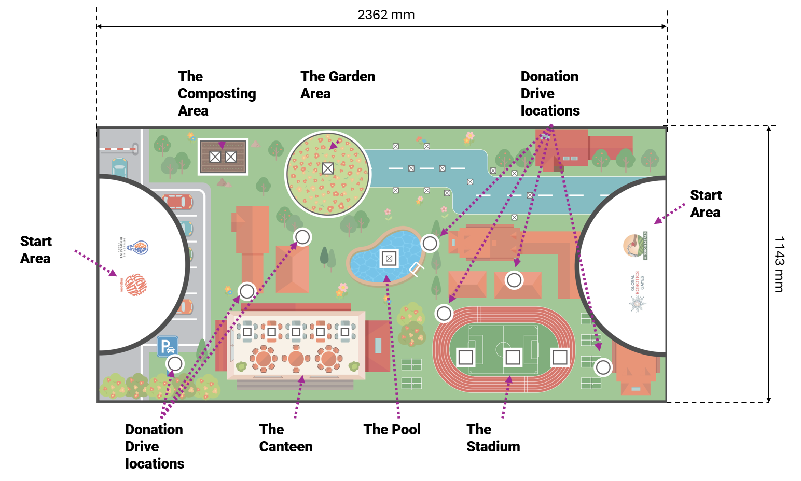
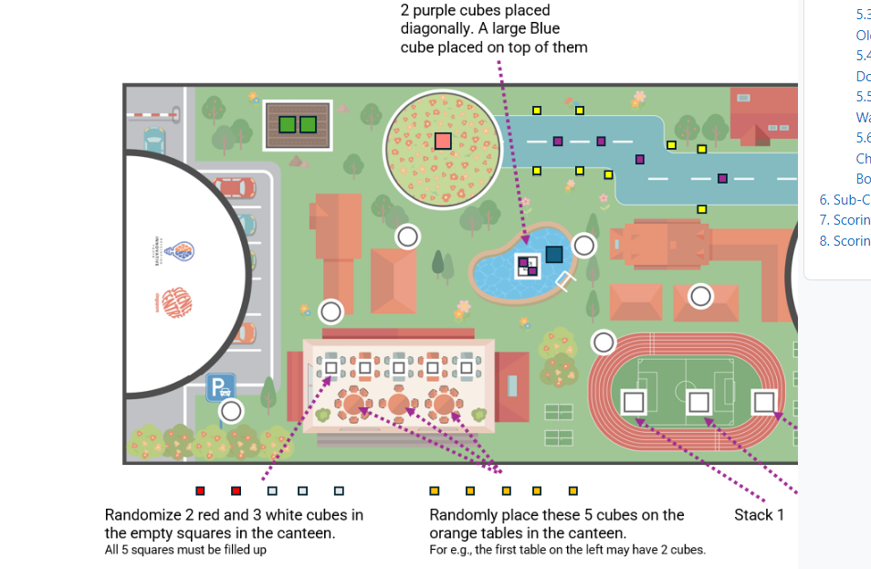
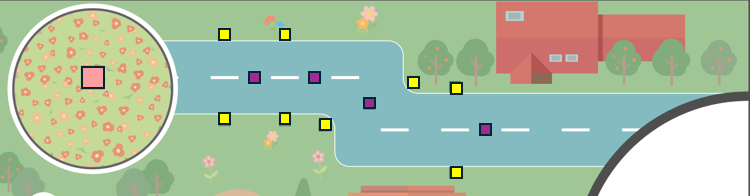
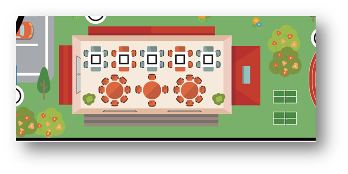
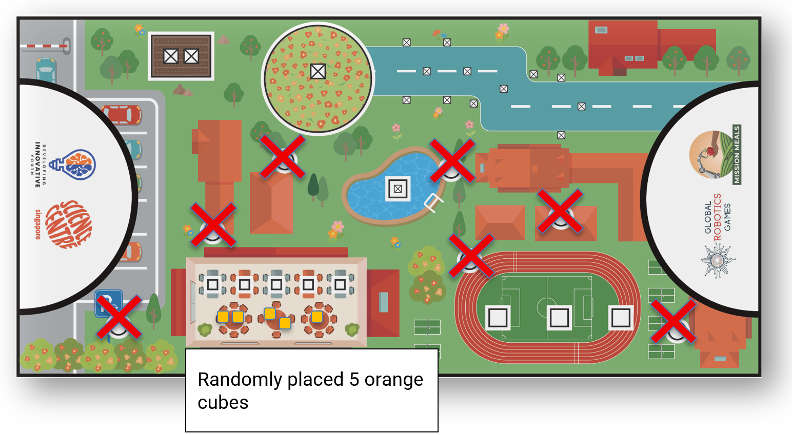
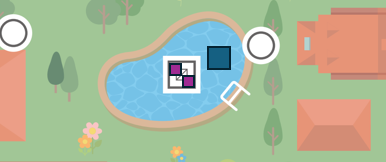

# 2026 GRG Mobile Robotics I (MR1) Rules - Original English Version

> [!IMPORTANT]  
> This is the exact verbatim original English rulebook as provided by the official Global Robotics Games.

## 1. Introduction

**Welcome to the Zero Hunger Challenge!**

**What is UN SDG #2: Zero Hunger?**  
Imagine you wake up tomorrow and there's no breakfast. Your stomach growls through your first class. This is how many children feel every day around the world. Now imagine a world where every single person has enough healthy food to eat every day. This is the goal of United Nations Sustainable Development Goal #2: Zero Hunger.
The world is a noticeably big place, and right now, it is struggling to feed everyone. In 2024, the UN found that about 1 in 12 people in the world—that is nearly 700+ million people—faced hunger. Even more concerning is that 2.3 billion people (nearly 1 out of every 3 people on Earth) do not always know where their next healthy meal is coming from.
When we look at children, the numbers show why we need your help. About 148 million children are smaller or weaker than they should be because they do not get enough nutrients. To solve this, we need to build "Sustainable Food Systems", which is just a fancy way of saying we need to be smarter and kinder about how we grow, share, and eat our food.

**Why are WE starting at School?**  
Change starts where we live and learn! Our competition takes place on a map of a school. By looking at our canteens, gardens, and classrooms, we can discover how to fight hunger right here at home. When we learn to manage food at school, we learn how to save the world!

**Your Robot’s Mission**  
This year, your team will build and program a robot to become a Mission Meals hero. Your missions are based on the real-world steps needed to achieve Zero Hunger:
- **Local Farming (Food Miles):** Reducing the distance food travels to keep it fresh and save fuel.
- **Waste Reduction (Lunchroom Leftovers):** Using technology to sort food so that nothing good goes to waste.
- **The Circle of Life (Compost Crusaders):** Turning old food scraps into "brown gold" (compost) to grow new plants.
- **Community Kindness (Sharing is Caring):** Making sure extra food gets to the people who need it most.
- **Smart Resources (Water for Our Plants):** Using robots to protect our most precious resource: water.
- **Quality Control (Healthy Snack Detectives):** Ensuring every snack is safe, healthy, and ready to eat!

**Become a Changemaker!**  
As you work on your robot, we want you to think like an explorer. Ask your teammates:
- Where does our canteen food come from?
- How can we help our school waste less water?
- How can robots make it easier to share with others?

The code you write and the robot you build today are the first steps toward a world where no one goes hungry. Let us get to work, Mission Meal heroes!

---

## 2. Guide to reading the Challenge Doc

Here is a guide that you can follow to understand how the robot game's document has been organized.

**Step 1: Read the Introduction.**  
This tells you about the hunger problem in our world and how you can help solve it.

**Step 2: Glance through the Game Field.**  
This is the playfield on which your robot will run. It shows you the placement of the missions. You will find two semi circles on the left and right of the playfield. These are called Start Areas and they are like your home.

**Step 3: Understand the missions.**  
As you go through the missions, refer to the game field. Some missions stay in one place, while others have props you can move around. Importantly, know the scores you get for each mission and learn how to earn points for each mission carefully. 

**Step 4: Read the Rules for the dos and don’ts.**  
It is important to understand what rules you must follow so you don't get disqualified (removed from the game).

That’s it! This was an easy guide to get you started in your Global Robotics Games journey. Have fun reading and coding!

---

## 3. Game Field

**The Game Field: Your school compound**
The competition takes place on a large mat that represents a School Compound.
The mat is divided into different zones that look just like your school:

- 🟩 **Start Areas:** These are the areas where your robot begins its journey and where you can safely touch your robot during the match.
- 🟩 **The Garden:** Where the pink and purple cubes ‘grow.’
- 🟩 **The Canteen:** A busy area where snacks and food are sorted and shared.
- 🟩 **The Pool & Compost Areas:** Specialized zones for water and recycling old food into soil, respectively.
- 🟩 **The Stadium:** Where dietary requirements must be met to provide energy for physical activities.

**Symbols and Markings**
Keep a close eye on the shapes printed on the mat:
- **Empty Squares:** These show you exactly where a cube should be placed at the start of the match.
- **Empty Circles:** These are "Target Zones." If you deliver a resource into a circle, you will earn points!

### 3.1 Start Area
The Start Area is where every team begins their robot-run.
What happens in the Start Area:
- ✅ Your robot gets checked before each run (refer to 6.1: Pre-Run).
- ✅ You are allowed to touch your robot and robot-equipment during the match.
- ✅ You can leave behind robot equipments and parts here if your robot doesn't need them.
- ✅ You can store large or small cubes here (unless stated otherwise in the rules of the missions).

**No-Touch Rule:** Teams are not allowed to touch their robots, robot-equipment, or cubes if it is fully or partially outside of the black border at the Start Area.  
**Penalty:** If you accidentally touch any cube that is partially or fully outside the black border of the Start Area, the referee will remove that cube from the game permanently.

---

## 4. Game Objects & Positioning

**Game Field: Cube Starting Positions**
Before the start of the match, cubes of two sizes and assorted colours are spread out on the playfield. The starting positions may be marked with either a square or a circle with a black border.

Here is a pictorial guide to help you with the starting positions of the cubes:

**Mission Cube Designations**
You may refer to the table below to confirm the colours designated for each mission:

| Mission Name | Large Cubes (50mm) | Small Cubes (25mm) |
| --- | --- | --- |
| 5.1 Food Miles | 1 Pink | 4 Purple |
| 5.2 Lunchroom Leftovers | — | 3 White, 2 Red |
| 5.3 Compost Crusaders | 2 Green | (Uses 2 Red from 5.2) |
| 5.4 Sharing is Caring | — | 5 Orange |
| 5.5 Water for Plants | 1 Blue | 2 Purple |
| 5.6 Snack Detectives | S1: 1 Yellow S2: 2 White S3: 1 Yellow, 1 Blue | S1: 1 White S2: — S3: 1 White |
| Safety Bonus (5.1) | — | 8 Yellow (Obstacles) |

---

## 5. Robot Missions and Scoring

For a better understanding, the missions will be explained in multiple sections.

### 5.1. Food Miles Mission and School Garden Helpers

**Mission Description**
This mission is about finding out where our food comes from. To help stop hunger, we want our food to travel a short distance from the farm to our plate. Shorter travel time means food is fresher and better for us, and it helps the environment by using less fuel. This supports making food systems sustainable.

**Mission Requirements**
Your goal is to connect the resources from different points, simulating the flow of local produce:
- The robot must drive along the greyish-blue path with at least two turns.
- There is one large pink cube located in the garden area.
- The large pink cube cannot leave the Garden area at any time throughout the match.
- There are four small purple cubes randomly placed along the greyish-blue road (the path).
- The student's robot must connect the four small purple cubes to the one large pink cube.

**Scoring and Safety Constraints**
- **Scoring Constraint:** Any small purple cube that is not touching any of the surface of the large pink cube is considered not connected, either directly or indirectly, to the large pink cube and thus will not be scored. The flat surface of the small purple cubes not connected to the flat surface of the large pink cube (either directly or through the connected cubes indirectly) will not be scored.
- **Safety/Foul Constraint:** The robot must be careful to avoid touching the yellow cubes. If the yellow cubes touch any of the purple cubes, those purple cubes will not receive any scores.
- **Scoring Constraint:** The pink cube may only touch the small purple cubes. At the end of the match, the pink cube should not be touching any other coloured cubes.

### 5.2. Lunchroom Leftovers: Wasting Less Food

**Mission Description: Food Waste Reduction**
This mission teaches us to stop wasting food. A big part of solving world hunger is making sure we use all the food we produce. Robots can help sort out what food is still good for consumption and what should be composted (turn old food into new soil). By identifying and classifying food accurately, we make sure only spoilt food is thrown away, helping everyone get enough to eat.

**Mission Requirements**
The robot must distinguish between distinct types of food to promote waste reduction:
- There are five small cubes located in the canteen area.
- These five cubes are split into three white cubes and two red cubes.
- The robot needs to accurately identify the two red cubes (representing the "leftovers").
- The robot must then send the red cubes into the composting area.
- The robot must leave the three white cubes - food that is good for consumption - in the canteen area.

*The team will be penalised with demerit points if any of the white cubes are not found in their starting positions at the end of the match.*

### 5.3. Compost Crusaders: Turning Old Food into New Soil

**Mission Description: Composting and Soil Health**
Composting helps us turn food scraps into rich soil for growing new food. This is called sustainable resource use. Instead of throwing away old food, we use robotics to compost it into nutrients. This saves space in landfills and makes better soil, which is important for growing healthy crops year after year to fight hunger.

**Mission Requirements**
This mission requires the movement of both composting materials and finished compost (nutrients):
- The two small red cubes (collected from the Lunchroom Leftovers mission) must be fully delivered to the composting area.
- There are two large green cubes already present in the composting area.
- The robot must move these two large green cubes and bring them to any Start Area.

*Scoring Constraint: Teams will not score for Mission 5.3, if there are no red cubes in the composting area.*

### 5.4. Sharing is Caring: Food Donation Drive

**Mission Description: Food Donation Drive**
Some people don’t have access to enough food, while others have extra. This mission is about helping people who do not have enough food. In cities, it can be hard to get fresh food. Robots can help collect extra food and deliver it to places where it is needed. By organising this food donation drive, we help achieve food security and make sure no one goes hungry.

**Mission Requirements**
The objective is to collect and distribute food resources efficiently:
- There are five small orange cubes placed randomly on the tables in the canteen area.
- The robot must collect these five cubes.
- The collected cubes must then be sent to any of the seven circles marked across the game field.

*Spread the kindness - each cube you deliver helps to feed a hungry person!*

### 5.5. Water for Our Plants: Saving Water where we can

**Mission Description: Water Conservation**
Water is a precious resource for growing food. This mission focuses on saving water by using smart systems. Vertical farms use less water because they recycle it. The robot’s job is to protect the conserved water (blue cube) by removing other elements that may dirty or pollute it, showing how technology ensures we have enough water for all our plants, even with changing weather.

**Mission Requirements**
The challenge focuses on securing and conserving the precious resource:
- A stack is set up in the pool area, consisting of one large blue cube standing on top of two small purple cubes.
- The robot must remove the two small purple cubes from under the large blue cube.
- The two small purple cubes need to be out of the pool area when scoring is completed.
- The robot must leave the large blue cube anywhere within the pool area.

**Critical Constraint 1:** The large blue cube CANNOT enter any of the Start Areas.
**Critical Constraint 2:** Teams cannot use any other cubes to assist the robot in completing this mission.

### 5.6. Healthy Snack Detectives: Choosing Good Food for our Bodies

**Mission Description: Healthy Food detective**
To fight hunger, we must also promote good nutrition. This mission is about using robots and sensors to check the quality of food (the stacks) and collect important data. By carefully moving the food stacks without changing them, the robot acts like a detective, making sure that the food that reaches our plates are fresh and healthy.

**Mission Requirements**
The robot must transport food samples without damaging them:
- There are three pre-built stacks of cubes on the field:
  - First stack: 1 small white cube on top of 1 large yellow cube.
  - Second stack: 1 large white cube on top of 1 large white cube.
  - Third stack: 1 large yellow cube on the bottom, 1 small white cube in the middle, and 1 large blue cube on top.
- The robot must deliver the three stacks as they are to the Start Area.
- Referees will see that the team only touches the cubes when they are completely in the Start Area.
- If a stack is destroyed outside home or returned to the Start Area separately, they cannot be recombined to earn points.

**Critical Constraint:** The stacks cannot be modified in any way while being transported from the stadium area to any Start Area. No cubes can be added, removed, or rearranged.

---

## 6. Sub-Category Game Rules

If there is any uncertainty during the robot attempt, the Referee makes the final decision. The Referee should decide in favour of the team if no clear decision is possible.
The set of rules can be broken up into four sections. There are rules that the team must follow before the match begins (Pre-Run), rules to follow when the match has started and before the 2:00 minutes is up (During the Run), and rules to follow after the match has ended (post-run).

### 6.1 Getting Ready: Pre-Run Rules
Before the 2-minute match begins, we need to make sure your robot and equipment are ready for competition! This is called the Pre-Run check.
- 📏 **Size Check (The Robot Box):** Your main Robot and all its attached pieces (robot-equipment) must fit completely inside an imaginary box that is 250mm x 250mm x 250mm. Referees will check this size before your run.
- 📍 **Starting Position:** After the size check, your robot and all its equipment must be placed inside any of the Start Area. You cannot make any changes to your robot after it passes the size inspection and before the game starts.
- 🚫 **Magnets** are strictly not allowed on any part of the robot, including the robot body, attachments, mechanisms, or decorative parts. Robots found with magnets will be disqualified from the round.
- 🚫 **No Secret Parts:** You are not allowed to hide or keep any robot parts or attachments in your hand or off the game field to be used later during the match. Everything you plan to use must start on the field.
- 🧱 **LEGO® Only:** The referee will ensure you are only using official LEGO® bricks and parts.

### 6.2 The Match is About to Begin
- Time begins when the referee gives the signal to start. The referee will give a command: “G. R. G. Go!” (or something similar.)
- Match Duration: Each robot match is a maximum of 2:00 minutes long (120 seconds). After 120 seconds, the referee will not consider any points that the robot gains.

### 6.3 What You Can and Can't Do
During the match, when your robot is out on the field, most of the time you cannot touch it! However, you can stop your robot and touch it when it comes back to the Start Areas.

**If Your Robot is FULLY STOPPED in the Start Area, You ARE ALLOWED To:**
- **Touch Your Robot:** You can carefully touch and move your robot to a new spot inside the Start Area.
- **Switch Programs:** You can pick a different program for your robot to run next.
- **Manage Parts:** You can remove or add attachments (robot-equipment) and game objects (mission props) from the robot by hand.
- **Get Ready to Run:** Once you are done loading or unloading parts, you can move your robot into position to start its next run.
- **Connect Cubes by Hand:** You are allowed to manually connect the magnetic cubes together.

**At ANY TIME During the Match, You ARE NOT ALLOWED To:**
- **Touch a Moving Robot:** You cannot touch your robot when it is moving on the playfield. The referee will stop the match and record any scores.
- **Touch Props Outside:** You cannot repair or touch your robot-equipment or props that are even partly outside of the black border of the Start Area.
  - This rule is still in place even if your robot is stopped in the Start Area.
  - This rule applies even if the robot accidentally pushes a prop out of the Start Area.

### 6.4 How the Match Ends and Scoring

**When the Match Stops**
A robot attempt will end if:
- **Time Runs Out:** The 2-minute (120 seconds) clock hits zero.
- **Off the Table:** Your robot has completely driven off the game table.
- **Breaking Rules:** Your robot or team violates the rules or any regulations.
- **Shout "STOP":** A team member shouts "STOP,” and the robot completely stops moving.
  - If the robot is still moving after you call "STOP," the attempt will only end once the robot stops on its own or is stopped by the team.

**Finalising the Score**
- **Scoring Process:** After the robot run is over, the referee will score the attempt.
- **Sign-Off:** Teams must sign the scoring sheet (paper or digital) to agree with the score. Once you sign, no more changes can be made.
- **Disputes:** If a team refuses to sign after a reasonable time, the judge may disqualify the team for that round.
- **Coach and Proof:** Coaches are not allowed to join discussions with referees about scoring. Video or photo proof will not be accepted.
- **Empty Score Time:** If a team finishes a run without scoring any positive points, the time is automatically set to 120 seconds.
- **Ranking:** If teams have the same total points, their final ranking will be decided by the time recorded for their attempt.

---

## 7. Scoring

### Mission Scoring Summary
Use the table below to track your points and understand the maximum score for each mission.

| Mission | Points | Max |
| --- | --- | --- |
| **5.1 Food Miles Mission and School Garden Helpers** | | |
| Purple cubes connected to pink cube | 3 pts / cube | 12 |
| "Clean" Yellow cubes (not touching anything) | 1 pt / cube | 8 |
| **5.2 Lunchroom Leftovers: Wasting Less Food** | | |
| Red cubes delivered to Composting Area | 5 pts / cube | 10 |
| White cube is moved out of its starting position | -5 pts / cube | -15 |
| **5.3 Compost Crusaders: Turning Old Food into New Soil** | | |
| Green cubes delivered to Start Area (requires 2 red cubes in Composting Area) | 15 pts / cube | 30 |
| **5.4 Sharing is Caring: Food Donation Drive** | | |
| Orange cubes placed in any of the 7 target circles | 9 pts / cube | 45 |
| **5.5 Water for Our Plants: Saving Water where we can** | | |
| Two small Purple cubes no longer in Pool Area | 10 pts / cube | 20 |
| Blue cube remains in the Pool Area | 25 pts | 25 |
| **5.6 Healthy Snack Detectives: Choosing Good Food for our Bodies** | | |
| Stack 1 delivered to Start Area | 10 pts | 10 |
| Stack 2 delivered to Start Area | 15 pts | 15 |
| Stack 3 delivered to Start Area | 25 pts | 25 |
| **Total Possible Points** | | **200** |

## 8. Scoring Interpretation
This section will be uploaded soon
