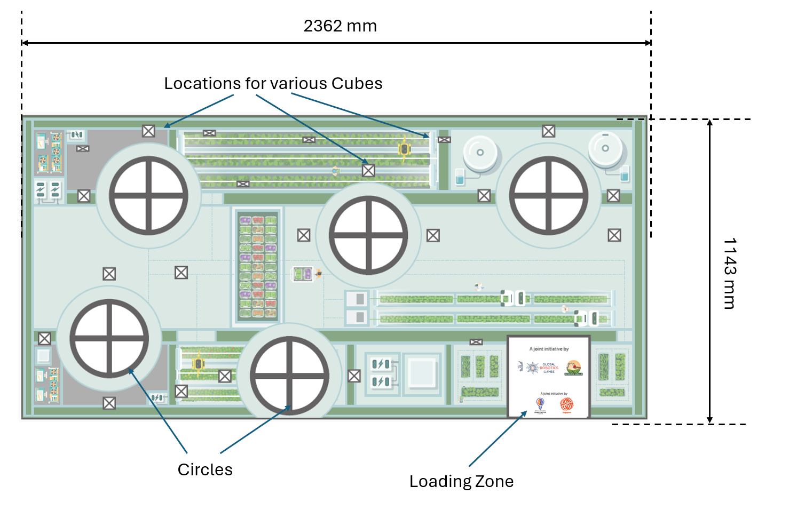
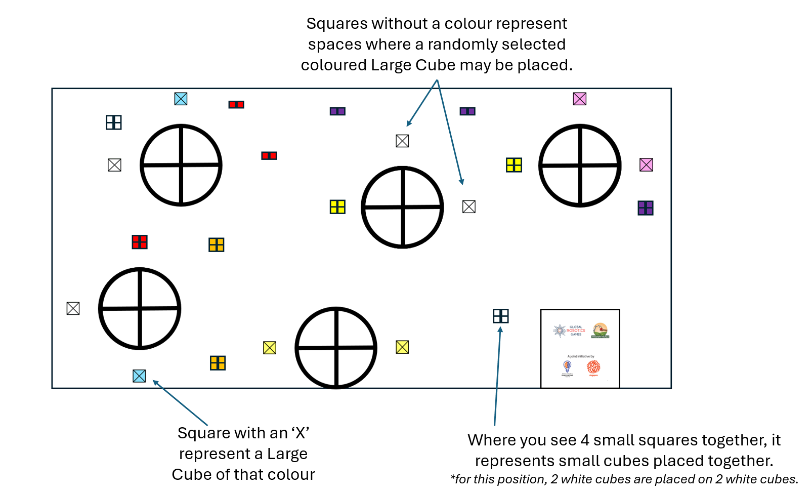
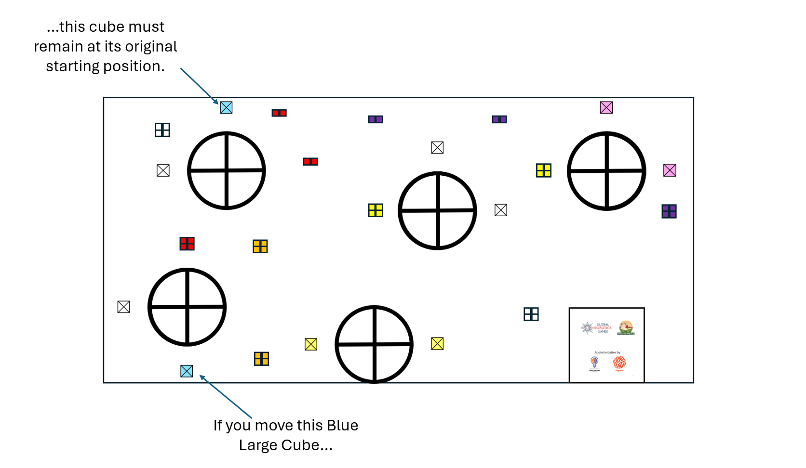

# 2026 GRG Mobile Robotics II & III (MR2 & MR3) Rules - Original English Version

> [!IMPORTANT]  
> This is the exact verbatim original English rulebook as provided by the official Global Robotics Games.

## 1. INTRODUCTION

**Mobile Robotics 2-3 | Mission: Zero Hunger**

This year’s Mobile Robotics II and III is inspired by UN Sustainable Development Goal (UN SDG) #2: Zero Hunger. This goal addresses the critical need to end hunger, achieve food security, improve nutrition, and promote sustainable agriculture.
The world faces a pressing challenge to feed a growing population. Factors like limited arable land, climate change, and urbanization threaten traditional farming methods and access to nutritious food. To address this problem, new solutions are emerging. Urban and vertical farming are innovative solutions that use robotics and technology to produce food efficiently in small, controlled environments. By focusing on these modern farming techniques, we can explore how robotics can help build a more resilient and nourished future for all.

*The Sustainable Development Goal Report 2025*

Our competition encourages participants to apply robotics and engineering skills to tackle critical issues related to Zero Hunger. One possible area is Vertical Farming. We want teams to discover how robots' computer systems are helping us grow food in harsh environments with as little resources needed. Each aspect of the challenge represents a real-world scenario where robots can make a meaningful difference.

**The Six Key Pillars of Vertical Farming**
- **Resource Management:** This function involves managing systems that regulate a farm's temperature, humidity, and airflow to maintain the precise conditions necessary for optimal plant health and growth.
- **Planting:** This task requires the precise deployment of seeds or seedlings to ensure consistent, accurate placement and efficient cultivating of crops.
- **Nutrient Delivery:** This involves automated systems dedicated to supplying water and nutrients to plants, simulating efficient irrigation and feeding processes.
- **Lighting:** This function focuses on deploying and managing specialized lights essential for photosynthesis, ensuring plants receive the correct light spectrum and intensity.
- **Harvesting:** This requires the careful removal of mature produce, demonstrating how automation can enhance efficiency and minimize damage to crops.
- **Monitoring and Data:** This pillar encompasses the collection and organization of "data" modules, highlighting the importance of sensors and data analytics in maintaining a highly productive and healthy farm environment.

Through these missions, we not only want teams to demonstrate their technical expertise but also gain valuable insight into the broader agricultural and food security impacts of their innovations. This competition is designed to empower young minds to be problem-solvers and changemakers. By aligning their robotics work with the vision of UN SDG #2: Zero Hunger, participants are encouraged to actively research and understand the challenges and opportunities within modern farming.

**Research Topics**
- **Food Scarcity in Urban Areas:** How can vertical farms provide fresh, local food to crowded cities?
- **Climate Resilience:** What role does environmental control play in protecting crops from changing weather patterns?
- **Sustainable Resource Use:** How do automated nutrient delivery and water recycling systems reduce the environmental footprint of agriculture?

The technology you develop on the playfield can help create a more sustainable and nourished world. Use this competition as a launchpad to research how your innovations can make a tangible difference in global food security.

---

## 2. Guide to reading the Challenge Doc

**QUICK START GUIDE**
**Your Roadmap to the Global Robotics Games**
Follow these four simple steps to understand your mission document and prepare your robot for the challenge!

**Step 1: Read the Introduction**
This gives you an outline of the situation in the world today based on the subject.

**Step 2: Glance through the Game Field**
This is the playfield on which your robot will run. Visualize your routes as you look at the map!

**Step 3: Understand the Missions**
As you go through the missions, refer back to the game field. Some missions are static, whereas some are movable mission props. Importantly, know the scores you get for each mission and understand the scoring criteria carefully.

**Step 4: Read the Rules (Do’s and Don’ts)**
There are times when you can touch your robot, robot-equipment, and Construction Equipment, and times when you cannot. Understand them well to avoid penalties.

That’s it!
This was a simple guide to get you started in your Global Robotics Games journey.
Have fun reading and coding!

---

## 3. Game Field

**SECTION 3: GAME FIELD**
**Mobile Robotics 2-3 | Ages 10–16**

**The Game Field: Your Vertical Farm**
The competition takes place on a large mat that represents a Vertical Farm. The playfield is where you will find all the elements needed to grow a successful farm:
- **Resources:** Elements like water, nutrients, and lighting are represented by the Cubes (large and small) scattered across the mat.
- **Missions:** The field is dotted with various locations where your robot must precisely build, stack, and place these Cubes to achieve mission goals.

### 3.1 Loading Zone
The Loading Zone is where every team starts their robot-run.
- The Loading Zone is where each robot is inspected. (refer to 6.1: Pre Run)
- The Loading Zone is where you are allowed to touch your robot and robot-equipment during the match.
- You may choose to leave behind robot-equipment and parts in the Loading Zone during the robot run.
- The Loading Zone may be used as a place to hold on to any Small Cubes only.

> [!WARNING]
> **⚠ IMPORTANT HANDLING RULES**
> - Teams are not allowed to touch their robots, robot-equipment or any Cubes if it is fully or even partially out of the Loading Zone. They must remain as is and can only be moved by a robot running autonomously.
> - The Run will stop if any robot or robot equipment is touched while it is fully or even partially out of the Loading Zone.
> - Any cubes that are touched while fully or partially out of the Loading Zone will be confiscated.

---

## 4. Game Objects & Positioning

**4. GAME OBJECTS & POSITIONING**
**Mobile Robotics 2-3 | Setup & Identification**

Before the start of the match, cubes of various sizes and colours are spread out on the playfield. The starting positions will be marked with an **X in a square**.

**Note:** Carefully study the colour of the cubes. Some coloured Cubes have the same starting position, while other colours are randomized.

**Colour Code**

| Mission Category | Large Cube (The Facility) | Small Cube (The Resource) | Real-World Meaning |
| --- | --- | --- | --- |
| **Harvesting** | White | White | Gathering fresh produce from the garden. |
| **Planting** | Green | Orange | Placing seeds into the soil to grow. |
| **Nutrient Delivery** | Blue | Purple | Feeding plants with water and vitamins. |
| **Sorting** | Pink | Red | Separating healthy food from leftovers. |
| **Lighting Control** | Yellow | Yellow | Managing energy for indoor vertical farms. |

---

## 5. Robot Missions and Scoring

**5. ROBOT MISSIONS AND SCORING**
For a better understanding, the missions will be explained in multiple sections.
________________________________________________________________
**Scoring for each mission will be:**
**Final State (scoring is done when the Robot Attempt ends)**
__________________________________________________________________

Your main objective in this competition is to use your robot arm to help manage the resources in the vertical farm. You achieve this by building stable, two-cube towers called **Resource Management Stacks**.

### 5.1 What is a "Stack"?

**Rules for a Valid Stack:**
- **Two Cubes Required:** A Stack must consist of exactly two Large Cubes.
- **Colour Match:** The two Large Cubes must be the exact same colour to be a Valid Stack (e.g., a Yellow Large Cube on a Yellow Large Cube).
- **Direct Contact:** The same-coloured Large Cubes must be resting in direct physical contact with each other.
- **Stable Placement:** A Large Cube is successfully 'stacked' only when it is resting solely on the Large Cube beneath it and is not touching the playfield.
- **No Robot Support:** Neither the robot nor any robot equipment may be touching or supporting any part of the Large Cube once it is stacked.

**Special Rule: Large Cube Pairs**
- **Original Location Rule:** To earn points for a Stack, you must move only one of the two Large Cubes of that specific colour. The other corresponding Large Cube must remain in its original location to be counted as part of a Stack.
  - *Example: If you move one Blue Large Cube out of a circle, the other Blue Large Cube for that pairing must stay in its starting location.*

**Invalid Stack**
An Invalid Stack is created when one Large Cube is placed on top of another Large Cube, but they are of different colours. You will earn less points for an Invalid Stack.
**Note on Manipulation:** There are special rules in Section 6.3 regarding the manipulation of Large Cubes. You must read these rules!

### 5.2 Enhancement Cubes
Enhancement Cubes are a way to make your existing ‘Vertical Farm’ more efficient and earn extra points beyond the basic Stack. They are small cubes added to the top of a valid Stack.
Enhancement Cubes are the Small Cubes that are added to the top of a Valid Stack to earn Bonus Points and demonstrate a more efficient Vertical Farm.

**Rules for Enhancement Cubes:**
- **Layer Definition:** A Layer is defined as exactly 4 small cubes placed on top of a Valid Stack.
- **Maximum Layers:** Since there are 8 small cubes of the same colour available for each Stack, a maximum of 2 Layers can be placed on a single Valid Stack.
- **Colour Coordination:** The Small Cubes must correspond to the colour of the Valid Stack they are placed on (refer to the Colour Code table in Section 4).
  - *Example: A Valid Stack of Large Green Cubes (Planting) requires four Small Orange Cubes on top to create an Enhanced Planting Stack*

The goal is to build proper same-coloured Stacks and to add Enhancement Stacks from the field and bring them together to create a well running Vertical Farm!

### 5.3 How Do You Score Points?

#### 5.3.1 Points for the Stacked Cubes
You earn points for every valid Stack built up.
| Large Cube Stack | Points gained |
| --- | --- |
| White | 70 |
| Green | 60 |
| Blue | 50 |
| Pink | 40 |
| Yellow | 30 |
| Invalid Stack | 20 |

#### 5.3.2 Points for the Enhancement Cubes
Here are the points you can earn for Enhancement Cubes:
| Small Cube layer | Points gained per successful layer |
| --- | --- |
| White | 50 |
| Orange | 40 |
| Purple | 30 |
| Red | 20 |
| Yellow | 20 |
| Mixed colour layer | 15 |

---

## 6. Sub-Category Game Rules

**6. SUB-CATEGORY GAME RULES**
**Pre-Run, During the Run, and Post-Run Guidelines**
If there is any uncertainty during the robot attempt, the Referee makes the final decision. The Referee should decide in favour of the team if no clear decision is possible.
The set of rules can be broken up into three sections. There are rules that the team must follow before the match begins (Pre-Run), rules to follow when the match has started and before the 2:00 minutes is up (During the Run), and rules to follow after the match has ended (Post-Run).

### 6.1 Getting Ready: Pre-Run Rules
Before the 2-minute match begins, we need to make sure your robot and equipment are ready for competition! This is called the Pre-Run check.
- **Size Check (The Robot Box):** Your main Robot and all its attached pieces (robot-equipment) must fit completely inside a box that is 250mm x 250mm x 250mm. Referees will check this size before your run.
- **Starting Position:** After the size check, your robot and all its equipment must be placed inside the Loading Zone. You can't make any changes to your robot after it passes the size inspection and before the game starts.
- **No Secret Parts:** You are not allowed to hide or keep any robot parts or attachments in your hand or off the game field to be used later during the match. Everything you plan to use must start on the field.
- **After robot’s size inspection:** Teams are not allowed to modify the robot’s assembly in any way. Teams are not allowed to overwrite the pre-existing codes.
- **LEGO® Only:** The referee will inspect everything to make sure you are only using official LEGO® bricks and parts.
- **Turn Off the Signal:** All wireless features like Bluetooth and Wi-Fi on your robot-hub must be completely turned off.

### 6.2 The match begins
- Time begins when the referee gives the signal to start.
- The referee will give a command: “G. R. G. Go!”.
- Each robot match has a maximum of 2 minutes (120 seconds)
- **Scoring End:** The referee will not consider any points gained by the robot after the 120-second timer has elapsed

### 6.3 What You Can and Can't Do During the Match
There are more rules, read them carefully:

**6.3.1 Allowed Actions for robot and robot equipment:**
You are ONLY allowed to interact with the robot or robot-equipment if the robot is fully stopped and completely within the Loading Zone.
| Action | Details |
| --- | --- |
| **Touch and Reposition** | You may touch and move your robot to any new spot inside the Loading Zone. |
| **Switch Programs** | You may rerun the current program or select a different program on the robot's hub for the next run. |
| **Handle Parts** | You may modify attachments (robot-equipment) and Small Cubes ONLY by hand. |

**6.3.2 Disallowed Actions (Any Time During the Match)**
| Rule | Restriction |
| --- | --- |
| **Touch a Moving Robot** | You cannot touch your robot when it is moving on the playfield outside of the Loading Zone. **Warning:** The referee will immediately stop the match and record any points gained up to that moment. |
| **Change the Code** | You cannot connect the robot's hub to a computing device to reprogram it or enter new data while the 2-minute timer is running. |
| **Touch Objects Outside Loading Zone** | You may only touch your robot, robot equipment, or any cubes when they are completely inside the Loading Zone. If any part of the robot, equipment, or cubes is outside the Loading Zone, you are not allowed to touch or adjust them, even if the robot has stopped. This rule still applies if the robot accidentally pushes any object out of the Loading Zone. |

**6.3.3 Rules for Cubes**
| Cube Type | Allowed Action (Any Time) | Disallowed Action (Any Time) | Special Manipulation Rule |
| --- | --- | --- | --- |
| **Small Cubes** | Can be transported anywhere on the playfield, including into the Loading Zone. | N/A | N/A |
| **Large Cubes** | Can be transported to any place on the playfield, except the Loading Zone (e.g., from one circle to another). | Cannot be brought into the Loading Zone. **Penalty:** They will be confiscated by the Referee. | Manipulation is only allowed when every part of the robot touching the playfield is fully within the Circle and the robot has come to a complete stop. |

### 6.4 How the Match Ends and Scoring
Your robot's attempt can end in a few different ways. Once the match ends, the referee will calculate your final score.

**When the Match Stops**
A robot attempt will end if:
- **Time Runs Out:** The 2-minute (120 seconds) clock hits zero.
- **Off the Table:** Your robot has completely driven off the game table.
- **Breaking Rules:** Your robot or team violates the rules or any regulations
- **Shout "STOP":** A team member shouts "STOP”, and the robot completely stops moving. But remember, If the robot is still moving after you call "STOP," the attempt will only end once the robot stops on its own or is stopped by the team. Referees will only stop the robot for you if you give them permission.

**Finalizing the Score**
- **Scoring Process:** After the robot run is over, the referee will score the attempt.
- **Sign-Off:** Teams must sign the scoring sheet (paper or digital) to agree with the score. Once you sign, no more changes can be made to the score. So read the scores given by the referees properly!
- **Disputes:** If a team refuses to sign the score after a reasonable amount of time, the judge may disqualify the team for that round.
- **Coach and Proof:** Coaches are not allowed to join discussions with the referees about the scoring. Sorry Coaches. Video or photo proof of your run will also not be accepted.
- **Empty Score Time:** If a team finishes a run without scoring any positive points, the time for that run is automatically set to 120 seconds.
- **Ranking:** If teams have the same total points, their final ranking will be decided by the time recorded for their attempt.

---

## 7. Scoring

**FINAL SCORING SHEET**
**Mobile Robotics 2-3 | Official Robot Game Score**

| Scoring Category | Points per Item (P) | Quantity (Q) | Points Earned (P x Q) |
| --- | --- | --- | --- |
| **A. RESOURCE MANAGEMENT STACKS (Large Cubes)** | | | |
| White Cube (Harvesting) | 70 | # of Stacks: ____________ | |
| Green Cube (Planting) | 60 | # of Stacks: ____________ | |
| Blue Cube (Nutrient Delivery) | 50 | # of Stacks: ____________ | |
| Pink Cube (Sorting) | 40 | # of Stacks: ____________ | |
| Yellow Cube (Lighting Control) | 30 | # of Stacks: ____________ | |
| Invalid Stack (Any two different colors) | 20 | # of Stacks: ____________ | |
| **B. ENHANCEMENT CUBES (Small Cube Layers)** | | | |
| White Small Cubes | 50 | # of Layers: ____________ | |
| Orange Small Cubes | 40 | # of Layers: ____________ | |
| Purple Small Cubes | 30 | # of Layers: ____________ | |
| Red Small Cubes | 20 | # of Layers: ____________ | |
| Yellow Small Cubes | 20 | # of Layers: ____________ | |
| Any 4 Small Cubes on a Valid Stack | 15 | # of Layers: ____________ | |
| **GRAND TOTAL SCORE:** | | | _________________ |

## 8. Scoring Interpretations
Will be added in future.
