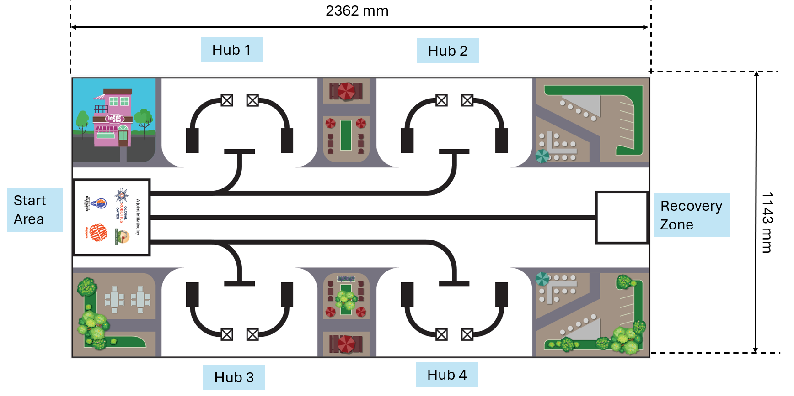
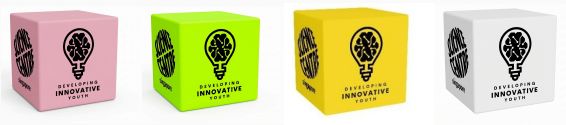
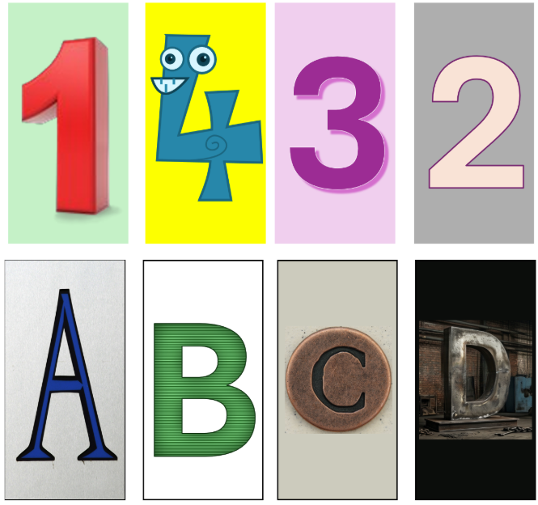

# MR4 完整中文規則

> [!IMPORTANT]
> 此中文規則完全基於官方最新釋出的 PDF 進行精準翻譯與校對。
> **注意**：原官方文件中，第 4 節的大方塊顏色標示為「粉、綠、黃、白」，但在第 5.1 節的任務說明中則變為「綠、粉、藍、白」。這屬於官方文件的矛盾，請參賽隊伍以實際賽場與官方最新公告為準。

## 1. 簡介 (Introduction)
2026 年 Mobile Robotics IV 挑戰賽「任務餐點 (Mission Meals)」深深扎根於實現聯合國永續發展目標 #2：零飢餓 (Zero Hunger) 的全球使命。這個目標是呼籲所有國家採取行動，消除飢餓、達成糧食安全、改善營養並促進永續農業。

傳統的努力通常只專注於生產更多食物，但這項挑戰強調，如果不解決我們消費和管理現有資源方式中的系統性低效問題，真正的糧食安全是不可能的。貧困與飢餓仍然是相互交織的全球挑戰，往往因為缺乏基本必需品和有效管理資源所需的基礎設施而加劇。在許多現代城市環境中，存在著一種矛盾的情況：儘管存在大量有機物和生物廢料，但仍有數百萬人面臨長期的糧食不安全。

透過將這種廢料重新定義為重要的資源，我們可以開發創新的解決方案，在廢料和需求之間架起橋樑。「任務餐點」挑戰賽專注於收集有機生物廢料並將其轉化為城市農業計畫的營養豐富基礎。這個過程創造了一個永續的循環經濟，可以穩定當地的糧食供應，特別是對於那些難以獲得新鮮營養食物的貧困社區。

今年的比賽鼓勵參賽者應用先進的機器人技術與工程技能，來解決資源回收和糧食穩定這些關鍵問題。挑戰賽中的每個特定任務都代表了一個真實世界的場景，自主科技可以在其中對弱勢群體的生活產生有意義且積極的改變。透過部署機器人來處理廢料管理的物流，我們模擬了一個科技幫助社區克服增長與公平障礙的未來。

挑戰賽要求機器人作為一個自主回收與處理單元，負責審計、淨化和強化有機物。透過這些行動，學生們展示了機器人技術如何促進基本需求的分配，並支持需要幫助的人的生計。將技術創新與 SDG #2 的願景結合，參賽者可以了解其工作的更廣泛的社會與經濟影響，使他們成為解決問題的人，為所有人創造機會與永續社區的未來做出貢獻。

## 2. 閱讀挑戰文件指南 (Guide to reading the Challenge Document)
這是一份指南，您可以依照它來了解機器人比賽文件的組織方式：
1. **閱讀簡介 (Read the Introduction)**：這為您概述了當今世界基於主題的現狀。
2. **瀏覽比賽場地 (Glance through the Game Field)**：這是您的機器人運行的場地，它顯示了任務的配置。重要的一點是，請注意場地是以**指南針方向**定位的。有北、南、東和西。例如：起跑區 (Start Area) 在西方。
3. **了解任務 (Understand the missions)**：深入任務細節並對應場地。有些任務是固定的，而有些任務有可以移動的任務道具。重要的是，了解每個任務的分數並仔細學習計分標準。
4. **閱讀規則 (Read the Rules for the dos and don’ts)**：了解何時可以觸碰機器人與設備，何時不行。請充分理解它們。

## 3. 比賽場地 (Game Field)
### 3.1 場地方向定位 (Orientation of the playfield)
2026 年的比賽場地是一個複雜的物流景觀，具有幾個不同的操作區域和功能區。為了確保導航精度以及隊伍與裁判之間的清晰溝通，這些區域根據標準的指南針方向進行區分。

這套系統反映了航海圖和地形圖中使用的方​​法，傳統上利用羅盤玫瑰 (compass rose) 來幫助操作員根據特定地標定位自己。雖然地墊表面沒有直接印上羅盤玫瑰，但隊伍必須假設場地地理中心存在一個中央羅盤來定位其戰略規劃。這種定位對於編寫自主移動程式和理解任務目標的相對位置至關重要。

比賽場地使用中央羅盤定位：
- **西 (West)**：起跑區 (The Start Area)。
- **東 (East)**：回收區 (The Recovery Zone) - 中央處理設施。
- **中央區域 (Central Field)**：四個城市商業中心 (Urban Commercial Hubs) - 收集未經處理的生物廢料點。

### 3.2 起跑區與裝載區 (Start Area and Loading Bay)
- **起跑區 (Start Area)**：只有一個起跑區。在運行開始前，機器人必須完全放入起跑區內。起跑區被視為一個尺寸為 **250mm X 250mm X 250mm** 的立體盒子。周圍的線不包含在起跑區內。電纜線必須包含在這些尺寸內。機器人啟動後，尺寸不再受限。
- **裝載區 (Loading Bay)**：比賽開始後，起跑區就變成了裝載區。裝載區是場地上的 2D 平面空間。這意味著只有**接觸到裝載區內部的物體兩維度**才會被考慮，懸停在它上方的部分則不計算在內。在這個空間內，隊伍被允許觸碰他們的機器人、機器人設備和某些場地元素。關於在這個空間內什麼允許/不允許的具體規則，請見下方的比賽規則部分。

## 4. 遊戲物件、位置與隨機化 (Game Objects, Positioning, Randomisation)
| 任務道具 | 數量 | 位置與注意事項 |
| --- | --- | --- |
| 大方塊 (Large Cubes) | 8 個 | 有 4 種顏色。粉色 (Pink)、綠色 (Green)、黃色 (Yellow) (或藍色) 和白色 (White)。(這些圖片僅代表方塊的示意圖)   |
| 小方塊 (Small Cubes) | 16 個 | 4 個紫色 (Purple)，4 個黃色 (Yellow)，4 個橘色 (Orange)，4 個紅色 (Red)。從機器人身上開始出發。(這些圖片僅代表方塊的示意圖)   |
| AI 卡片 (AI cards) | 8 張 | 它們代表數字 1、2、3、4 以及字母 A、B、C、D。(註：可由隊伍自行列印) |

## 5. 機器人任務 (Robot Missions)
「以下任務代表了有機廢料從城市收集到高價值營養回收的旅程。計分嚴格基於 120 秒比賽結束時或隊伍示意停止時的場地最終狀態。」
整體目標是透過兩個關鍵的回收任務建立一個「綜合生物堆疊 (Integrated Bio-Stack)」。

### 5.1 任務 1：物流垂直堆疊 (Logistical Vertical Stacking)
**目標：** 此任務的目標是在指定的回收區 (Recovery Zone) 內進行中央生物廢料儲存庫的結構組裝。
這項任務模擬了在城市處理設施中，將穩定的有機物質工業整合為單一的高密度垂直塔，以優化空間與處理效率。
請注意，此任務的計分取決於建築的結構完整性與單一性。只有在比賽結束時整合為單一垂直塔的大方塊與其隨附的小方塊才能獲得分數。

**計分規範：**
裁判被指示每次運行只計算「一個」塔的分數；任何已送到回收區但被孤立、未堆疊或成為次要堆疊一部分的大方塊，都將無法獲得分數並記為零分。(*次要堆疊是指點數組合最低的堆疊。裁判將決定回收區的哪個堆疊進行計分。*)

**任務內容：**
- 四個 Hub 中各包含一個主要大方塊，且其頂面上已放置四個小方塊：
  - 綠色大方塊 x1，配 白色小方塊 x4
  - 粉色大方塊 x1，配 紅色小方塊 x4
  - 藍色大方塊 x1，配 紫色小方塊 x4
  - 白色大方塊 x1，配 橘色小方塊 x4
- **強制 AI 識別 (Mandatory AI Detection)**：機器人必須識別 Hub 處的「數字卡 (1-4)」以確定方塊在最終塔中的位置。
  - **注意**：此識別必須完全透過基於 AI 的電腦視覺模型執行；**嚴格禁止**使用簡單的顏色或距離感測器來區分卡片。
- 機器人必須將這些主要大方塊連同其表面的小方塊運送到東邊的**回收區 (Recovery Zone)**。
- 機器人必須將方塊堆疊成一個單一的垂直柱：'1' 在最底層，'2' 在第二層，'3' 在第三層，'4' 在頂端。

**計分要求 (SCORING REQUIREMENTS)：**
| 項目 | 分數 |
| --- | --- |
| **塔的整合 (Tower Integration)**：每個主要大方塊及其隨附的小方塊正確堆疊在單一垂直柱中。 | 每個大方塊組合 5 分 |
| **堆疊完整性 (Stacking Integrity)**：如果方塊相對於底部處於正確的數字位置 (例如，數字 1 對應的方塊在最底層)，則獲得額外分數。 | 每個大方塊組合 20 分 |

### 5.2 任務 2：營養素注入/現場強化 (Nutrient Injection)
**目標：** 使用機器人攜帶的特定營養添加劑，在 Hub 處強化第二批空的廢料。

**任務內容：**
- 每個 Hub 都包含一個次要大方塊 (空的)。
- 機器人攜帶 16 個小方塊的車載庫存 (紅、紫、黃、橘各 4 個)。
- 機器人必須讀取 Hub 處的「字母卡 (A-D)」。
  - **注意**：為了確保技術嚴謹性，**僅允許使用 AI 驅動的識別模型**來解釋字母卡。未能使用 AI 模型完成此任務將導致該 Hub 得零分。
- 機器人必須將四個相符顏色的小方塊分配/放置到次要大方塊上。
- **營養素對應**：根據識別出的字母放置這些彩色小方塊：
  - A：4 個紅色小方塊
  - B：4 個紫色小方塊
  - C：4 個黃色小方塊
  - D：4 個橘色小方塊

**計分要求：**
| 項目 | 分數 |
| --- | --- |
| **成功強化 (Successful Fortification)**：如果在比賽結束時次要大方塊上放置了正確的 4 個相符小方塊。 | 每個 Hub 20 分 (最高 80 分) |
| **位置 (Location)**：次要大方塊必須完全留在其原始的 Hub 正方形內才能計分。 | 每個 Hub 5 分 |

## 6. 比賽規則 (Sub-Category Game Rules)
### 6.1 賽前準備 (Pre-Run)
機器人將在進入隔離區前，由裁判根據要求進行檢查。
隊伍的機器人與機器人設備必須能放入 **250mm X 250mm X 250mm** 的空間內。
**AI 驗證 (AI Validation)**：在檢查期間，隊伍必須聲明用於檢測卡片的特定 AI 模型或框架。裁判可能會要求進行簡短的展示或程式碼驗證，以確保沒有使用非 AI 的捷徑（例如顏色閾值或機械觸發）來「讀取」卡片。未能證明使用 AI 來檢測卡片將導致該次運行被棄權。
在檢查期間，隊伍將被要求將其機器人與機器人設備放置在起跑區 (Start Area)。
機器人、機器人設備以及用於任務 2 的 16 個小方塊必須在起跑區裝載到機器人上。
接下來，隊伍將被要求擲骰子。骰子上的數字代表卡片將如何放置在 4 個 Hub 中。首先，隊伍將多次擲骰子來決定 Hub 1 要放置的卡片，然後是 Hub 2，Hub 3，最後是 Hub 4。
第一次擲骰子決定數字卡 (number card)。第二次擲骰子決定字母卡 (letter card)。
Hub 1 的卡片放置完成後，才會繼續進行 Hub 2 的放置。

| 骰子上的數字 (Number on die) | AI 數字卡 (AI number card) |
| --- | --- |
| 1 | 1 |
| 2 | 2 |
| 3 | 3 |
| 4 | 4 |
| 5 或 6 | 重擲 (Roll again) |

| 骰子上的數字 (Number on die) | AI 字母卡 (AI letter card) |
| --- | --- |
| 1 | A |
| 2 | B |
| 3 | C |
| 4 | D |
| 5 或 6 | 重擲 (Roll again) |

隊伍不允許將任何零件或配件存放在場外以備在比賽期間引入（例如，用手拿著「LEGO 治具 (LEGO jigs)」）。
隊伍不允許透過改變機器人零件的位置或方向來向程式輸入數據，也不允許對機器人進行任何感測器校準。
隊伍只被允許在起跑區 (Start Area) 內徒手調整機器人。
機器人主機中的所有無線通訊功能都必須關閉；必須停用藍牙和 Wi-Fi。除非需要用它來執行 AI 模型，在這種情況下，隊伍必須證明無線通訊僅用於連接機器人與電腦以執行 AI 模型（如有需要）。無線通訊不能用於向機器人發送任何移動指令（馬達控制）。

### 6.2 比賽開始 (Start of a Match)
當裁判發出開始信號時，計時開始。
裁判將給出指令：「G. R. G. Go！」（或裁判選擇的任何其他信號）。
每場機器人比賽最長為 2:00 分鐘 (120 秒)。
在 120 秒後，裁判不會將機器人獲得的任何分數計算在內。

### 6.3 機器人運行期間 (During Robot Run)
- **單批次規則 (The Single Batch Rule)**：機器人**在任何時間點只能將一個大方塊帶入起跑區**。(小方塊的數量沒有限制。)
  - **裁判執行**：如果起跑區內有一個以上的大方塊，裁判將隨機沒收剩下的大方塊，只留一個。被沒收的將視為出局。
- 當機器人或設備**完全在起跑區內靜止**時，隊伍允許：
  - 在起跑區內觸碰並重新定位機器人。
  - 切換程式。
  - 徒手卸載/移動/觸碰任務道具與設備。
  - 將任務道具從起跑區徒手裝載到機器人上。
- **隊伍不允許**：
  - 在機器人於場地移動時觸碰機器人。
  - 在機器人移動時觸碰起跑區外的道具。
  - 運行期間重新編程或輸入數據。
  - 當機器人在起跑區內時完成任務得分。

### 6.4 運行結束 (Ending of Robot Run)
- 結束條件：120 秒耗盡、機器人離開桌面、違反規則，或隊員大喊「STOP」且機器人不再移動。
- 運行後進行計分，隊伍需簽名確認，之後不可更改。若未獲正分，時間將自動記為 120 秒。

## 7. 計分表 (Scoring)
| 任務說明 | 單項分數 | 最高分數 |
| --- | --- | --- |
| **5.1 物流垂直堆疊** | | **100** |
| 大方塊整合到回收區的單一垂直塔中 | 5 | |
| 大方塊放置在正確的數字順序中 (1 在底，4 在頂) | 20 | |
| **5.2 營養素注入** | | **100** |
| 在次要大方塊上放置正確顏色的 4 個小方塊 | 20 | |
| 次要大方塊 (帶有正確營養素) 完全在其 Hub 圓圈內 | 5 | |
| **總最高分數** | | **200** |
